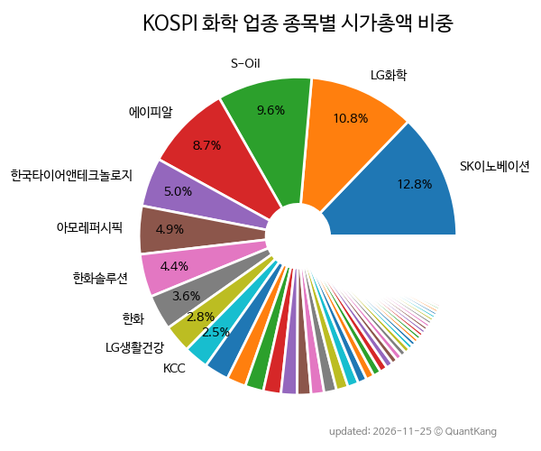

{: .align-center}

> **종목 목록 (123)**

| **종목** | **PER** | **PBR** | **DIV** | **비중** |
| :------- | ------: | ------: | ------: | -------: |
| [SK이노베이션](/096770/) | - | 0.8 | - | 12.8<small>%</small> |
| [LG화학](/051910/) | - | 0.5 | 0.9<small>%</small> | 10.8<small>%</small> |
| [S-Oil](/010950/) | 65.7 | 1.3 | 0.3<small>%</small> | 9.6<small>%</small> |
| [에이피알](/278470/) | 38.6 | 25.1 | 1.7<small>%</small> | 8.7<small>%</small> |
| [한국타이어앤테크놀로지](/161390/) | 6.8 | 0.6 | 3.8<small>%</small> | 5.0<small>%</small> |
| [아모레퍼시픽](/090430/) | 41.7 | 1.8 | 0.9<small>%</small> | 4.9<small>%</small> |
| [한화솔루션](/009830/) | - | 0.4 | - | 4.4<small>%</small> |
| [한화](/000880/) | 17.8 | 0.5 | 1.5<small>%</small> | 3.6<small>%</small> |
| [LG생활건강](/051900/) | - | 0.8 | 0.8<small>%</small> | 2.8<small>%</small> |
| [KCC](/002380/) | 1.7 | 0.3 | 4.3<small>%</small> | 2.5<small>%</small> |
| [SKC](/011790/) | - | 3.0 | - | 2.5<small>%</small> |
| [한국콜마](/161890/) | 24.4 | 3.4 | 0.7<small>%</small> | 2.0<small>%</small> |
| [코스맥스](/192820/) | 29.0 | 6.4 | 1.1<small>%</small> | 1.9<small>%</small> |
| [금호석유화학](/011780/) | 8.4 | 0.4 | 1.8<small>%</small> | 1.8<small>%</small> |
| [달바글로벌](/483650/) | 20.6 | 8.5 | 1.9<small>%</small> | 1.6<small>%</small> |
| [롯데케미칼](/011170/) | - | 0.1 | 2.2<small>%</small> | 1.4<small>%</small> |
| [한솔케미칼](/014680/) | 14.3 | 1.9 | 1.4<small>%</small> | 1.3<small>%</small> |
| [금호타이어](/073240/) | 4.2 | 0.7 | - | 1.3<small>%</small> |
| [아모레퍼시픽홀딩스](/002790/) | 21.1 | 0.7 | 1.4<small>%</small> | 1.2<small>%</small> |
| [이수스페셜티케미컬](/457190/) | 3315.4 | 19.6 | - | 1.1<small>%</small> |
| [코오롱인더](/120110/) | 158.7 | 0.3 | 3.6<small>%</small> | 0.9<small>%</small> |
| [효성티앤씨](/298020/) | 104.3 | 0.7 | 3.9<small>%</small> | 0.8<small>%</small> |
| [후성](/093370/) | 177.6 | 2.9 | - | 0.8<small>%</small> |
| 코스모신소재 | - | 2.2 | - | 0.8<small>%</small> |
| [롯데정밀화학](/004000/) | 7.7 | 0.3 | 4.7<small>%</small> | 0.7<small>%</small> |
| [DL](/000210/) | - | 0.2 | - | 0.6<small>%</small> |
| [태광산업](/003240/) | 8.8 | 0.2 | 0.2<small>%</small> | 0.6<small>%</small> |
| LG화학우 | - | - | 2.1<small>%</small> | 0.6<small>%</small> |
| [SK케미칼](/285130/) | 18.4 | 0.4 | 2.7<small>%</small> | 0.5<small>%</small> |
| [HS효성첨단소재](/298050/) | - | 0.9 | 1.5<small>%</small> | 0.4<small>%</small> |
| [OCI](/456040/) | - | 0.4 | - | 0.4<small>%</small> |
| 한국쉘석유 | 11.2 | 3.8 | 8.7<small>%</small> | 0.4<small>%</small> |
| [미원에스씨](/268280/) | 10.2 | 1.4 | 2.5<small>%</small> | 0.4<small>%</small> |
| [TKG휴켐스](/069260/) | 7.1 | 0.5 | 9.0<small>%</small> | 0.4<small>%</small> |
| 금양 | - | 1.4 | - | 0.4<small>%</small> |
| 넥센타이어 | 3.7 | 0.3 | 3.6<small>%</small> | 0.4<small>%</small> |
| 카프로 | - | - | - | 0.4<small>%</small> |
| [동원시스템즈](/014820/) | 11.0 | 0.7 | 4.5<small>%</small> | 0.4<small>%</small> |
| 한화3우B | - | - | 5.1<small>%</small> | 0.3<small>%</small> |
| [미원상사](/002840/) | 14.1 | 1.5 | 1.8<small>%</small> | 0.3<small>%</small> |
| PI첨단소재 | 13.4 | 1.1 | 2.5<small>%</small> | 0.3<small>%</small> |
| [대한유화](/006650/) | 16.1 | 0.3 | 1.6<small>%</small> | 0.3<small>%</small> |
| 아모레퍼시픽우 | - | - | 3.1<small>%</small> | 0.3<small>%</small> |
| 애경케미칼 | - | 0.6 | 1.6<small>%</small> | 0.3<small>%</small> |
| 유니드 | 5.3 | 0.3 | 3.8<small>%</small> | 0.3<small>%</small> |
| KPX홀딩스 | 4.1 | 0.3 | 6.3<small>%</small> | 0.2<small>%</small> |
| [코스모화학](/005420/) | - | 1.4 | - | 0.2<small>%</small> |
| [율촌화학](/008730/) | 54.9 | 0.8 | 2.7<small>%</small> | 0.2<small>%</small> |
| 국도화학 | 11.4 | 0.3 | 4.5<small>%</small> | 0.2<small>%</small> |
| 넥센 | 3.5 | 0.2 | 2.9<small>%</small> | 0.2<small>%</small> |
| 이수화학 | - | 2.3 | - | 0.2<small>%</small> |
| LX하우시스 | - | 0.3 | - | 0.2<small>%</small> |
| 애경산업 | 16.6 | 0.6 | 2.0<small>%</small> | 0.2<small>%</small> |
| 에이블씨엔씨 | 16.3 | 2.6 | 4.9<small>%</small> | 0.2<small>%</small> |
| 남해화학 | 8.9 | 0.5 | 1.7<small>%</small> | 0.2<small>%</small> |
| 효성화학 | 0.4 | 0.3 | - | 0.2<small>%</small> |
| KG케미칼 | 3.0 | 0.2 | 4.9<small>%</small> | 0.2<small>%</small> |
| S-Oil우 | - | - | 0.6<small>%</small> | 0.2<small>%</small> |
| 송원산업 | 102.6 | 0.3 | 3.0<small>%</small> | 0.2<small>%</small> |
| 서흥 | 3.8 | 0.3 | 3.4<small>%</small> | 0.2<small>%</small> |
| 미창석유 | 2.3 | 0.3 | 3.4<small>%</small> | 0.2<small>%</small> |
| 미원화학 | 9.6 | 1.3 | 3.8<small>%</small> | 0.1<small>%</small> |
| 한국화장품제조 | 9.5 | 2.5 | 0.4<small>%</small> | 0.1<small>%</small> |
| KPX케미칼 | 5.0 | 0.3 | 7.1<small>%</small> | 0.1<small>%</small> |
| LG생활건강우 | - | - | 2.2<small>%</small> | 0.1<small>%</small> |
| 잇츠한불 | 11.2 | 0.5 | 2.6<small>%</small> | 0.1<small>%</small> |
| 삼영 | 8.5 | 1.3 | 0.9<small>%</small> | 0.1<small>%</small> |
| PKC | 18.3 | 0.8 | 0.7<small>%</small> | 0.1<small>%</small> |
| 백산 | 6.0 | 0.7 | 4.8<small>%</small> | 0.1<small>%</small> |
| 진양홀딩스 | 9.3 | 0.5 | 6.8<small>%</small> | 0.1<small>%</small> |
| DS단석 | - | 0.5 | 0.1<small>%</small> | 0.1<small>%</small> |
| 한농화성 | 46.4 | 1.1 | 0.3<small>%</small> | 0.1<small>%</small> |
| 동성케미컬 | 5.0 | 0.4 | 4.5<small>%</small> | 0.1<small>%</small> |
| 경농 | 8.3 | 0.6 | 8.1<small>%</small> | 0.1<small>%</small> |
| SP삼화 | 18.8 | 0.5 | 6.0<small>%</small> | 0.1<small>%</small> |
| 노루페인트 | 9.6 | 0.4 | 5.2<small>%</small> | 0.1<small>%</small> |
| 강남제비스코 | - | 0.2 | 2.1<small>%</small> | 0.1<small>%</small> |
| 금호석유화학우 | - | - | 4.6<small>%</small> | 0.1<small>%</small> |
| 아모레퍼시픽홀딩스3우C | - | - | 3.0<small>%</small> | 0.1<small>%</small> |
| 대한화섬 | 11.7 | 0.2 | 0.7<small>%</small> | 0.1<small>%</small> |
| 삼양패키징 | 8.3 | 0.4 | 5.2<small>%</small> | 0.1<small>%</small> |
| 태경산업 | 5.6 | 0.4 | 5.5<small>%</small> | 0.1<small>%</small> |
| 일진다이아 | 16.9 | 0.3 | 3.7<small>%</small> | 0.1<small>%</small> |
| 경인양행 | 20.3 | 0.5 | 1.8<small>%</small> | 0.1<small>%</small> |
| 토니모리 | 10.1 | 0.9 | 1.1<small>%</small> | 0.1<small>%</small> |
| HDC현대EP | 2.5 | 0.2 | 5.0<small>%</small> | 0.1<small>%</small> |
| 그린케미칼 | 9.9 | 0.8 | 5.8<small>%</small> | 0.1<small>%</small> |
| 극동유화 | 89.4 | 0.5 | 6.6<small>%</small> | 0.1<small>%</small> |
| 동남합성 | 14.3 | 1.8 | 3.2<small>%</small> | 0.1<small>%</small> |
| NPC | 7.2 | 0.2 | 4.3<small>%</small> | 0.1<small>%</small> |
| 영보화학 | 5.3 | 0.5 | 7.6<small>%</small> | 0.1<small>%</small> |
| 차AI헬스케어 | 29.7 | 1.3 | - | 0.1<small>%</small> |
| SK이노베이션우 | - | - | - | 0.1<small>%</small> |
| DRB동일 | 16.4 | 0.2 | 2.1<small>%</small> | 0.0<small>%</small> |
| 동일고무벨트 | 6.6 | 0.3 | 3.0<small>%</small> | 0.0<small>%</small> |
| 동방아그로 | 6.8 | 0.4 | 6.0<small>%</small> | 0.0<small>%</small> |
| 아모레퍼시픽홀딩스우 | - | - | 3.6<small>%</small> | 0.0<small>%</small> |
| 코오롱인더우 | - | - | 6.3<small>%</small> | 0.0<small>%</small> |
| 휴비스 | 23.1 | 0.2 | - | 0.0<small>%</small> |
| 테이팩스 | 41.8 | 0.5 | 1.1<small>%</small> | 0.0<small>%</small> |
| 보락 | 25.7 | 1.2 | 0.7<small>%</small> | 0.0<small>%</small> |
| 태경케미컬 | 5.7 | 0.3 | 4.1<small>%</small> | 0.0<small>%</small> |
| 조비 | 23.9 | 0.9 | - | 0.0<small>%</small> |
| 덕성 | 10.7 | 0.6 | 3.0<small>%</small> | 0.0<small>%</small> |
| 진양산업 | 14.1 | 1.5 | 4.7<small>%</small> | 0.0<small>%</small> |
| SK케미칼우 | - | - | 5.4<small>%</small> | 0.0<small>%</small> |
| 조광페인트 | - | 0.1 | 7.2<small>%</small> | 0.0<small>%</small> |
| SB성보 | 1.2 | 0.3 | 10.0<small>%</small> | 0.0<small>%</small> |
| 한화솔루션우 | - | - | - | 0.0<small>%</small> |
| DL우 | - | - | - | 0.0<small>%</small> |
| WISCOM | 19.6 | 0.3 | 2.9<small>%</small> | 0.0<small>%</small> |
| 진양폴리 | 31.2 | 1.6 | 3.5<small>%</small> | 0.0<small>%</small> |
| 넥센타이어1우B | - | - | 5.7<small>%</small> | 0.0<small>%</small> |
| 진양화학 | 115.7 | 2.6 | - | 0.0<small>%</small> |
| LX하우시스우 | - | - | - | 0.0<small>%</small> |
| SH에너지화학 | - | 0.5 | - | 0.0<small>%</small> |
| SUN&L | - | 0.1 | - | 0.0<small>%</small> |
| 대원화성 | 2.9 | 0.2 | - | 0.0<small>%</small> |
| 넥센우 | - | - | 4.3<small>%</small> | 0.0<small>%</small> |
| NPC우 | - | - | 6.1<small>%</small> | 0.0<small>%</small> |
| 덕성우 | - | - | 2.0<small>%</small> | 0.0<small>%</small> |
| 노루페인트우 | - | - | 3.3<small>%</small> | 0.0<small>%</small> |
| 동원시스템즈우 | - | - | 7.5<small>%</small> | 0.0<small>%</small> |

