 
> **KOSPI**

[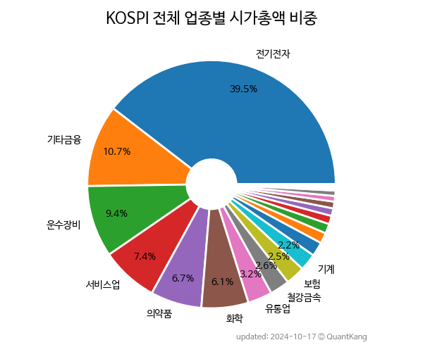](kospi_all_all_업종/)

[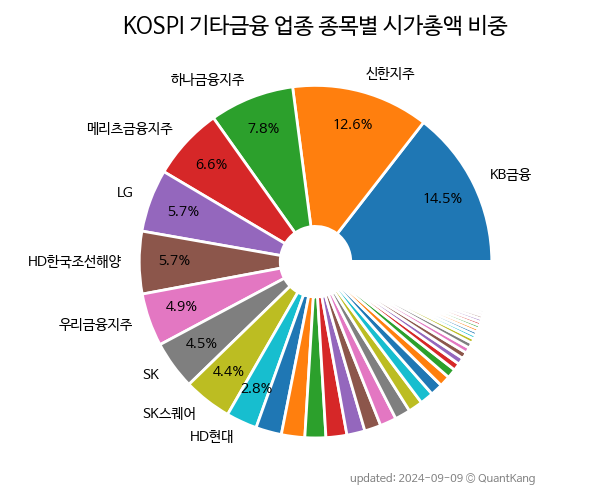](kospi_업종_기타금융_종목/)

[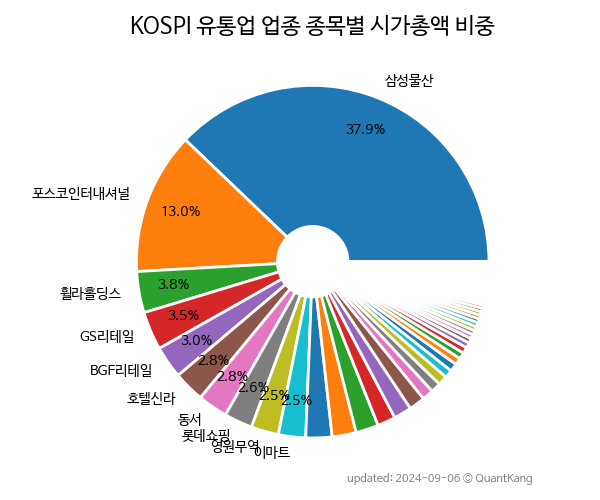](kospi_업종_유통업_종목/)

[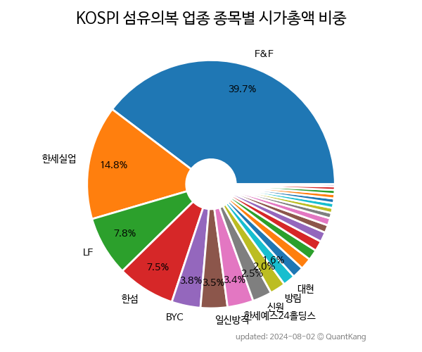](kospi_업종_섬유의복_종목/)

[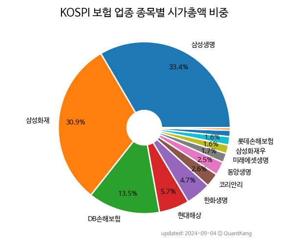](kospi_업종_보험_종목/)

[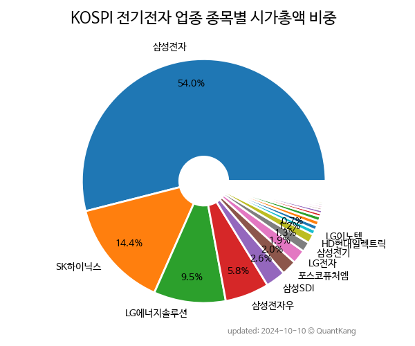](kospi_업종_전기전자_종목/)

[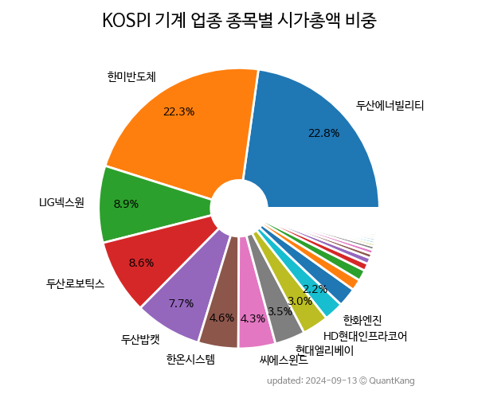](kospi_업종_기계_종목/)

[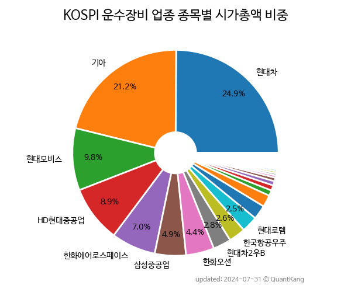](kospi_업종_운수장비_종목/)

[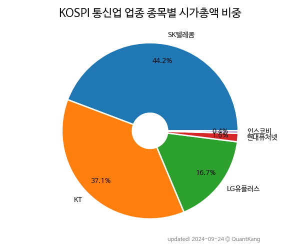](kospi_업종_통신업_종목/)

[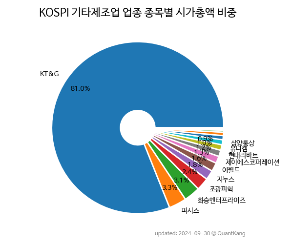](kospi_업종_기타제조업_종목/)

[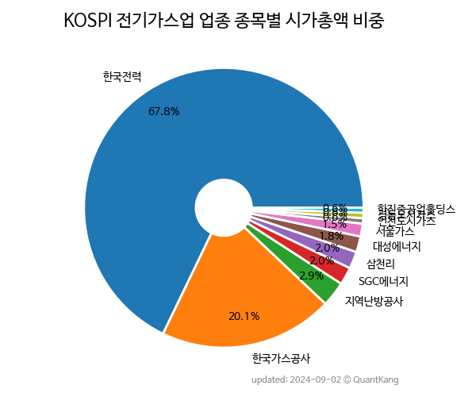](kospi_업종_전기가스업_종목/)

[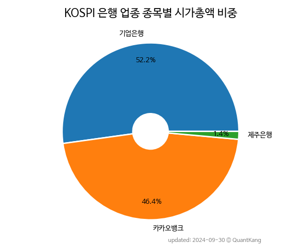](kospi_업종_은행_종목/)

[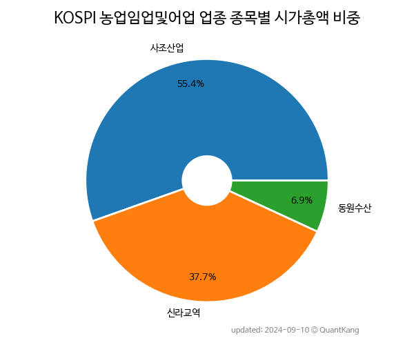](kospi_업종_농업임업및어업_종목/)

 
> **KOSDAQ**

[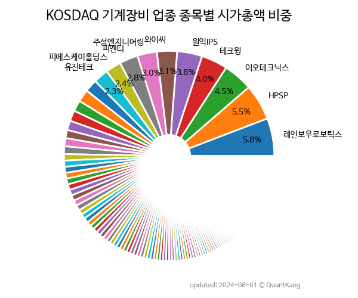](kosdaq_업종_기계장비_종목/)

[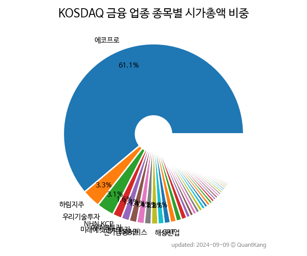](kosdaq_업종_금융_종목/)

[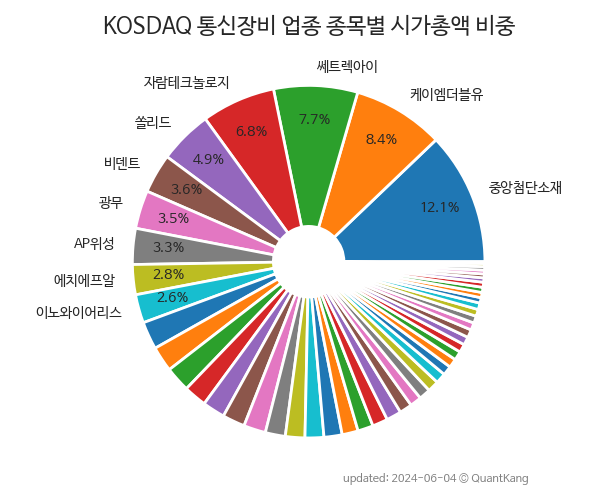](kosdaq_업종_통신장비_종목/)

[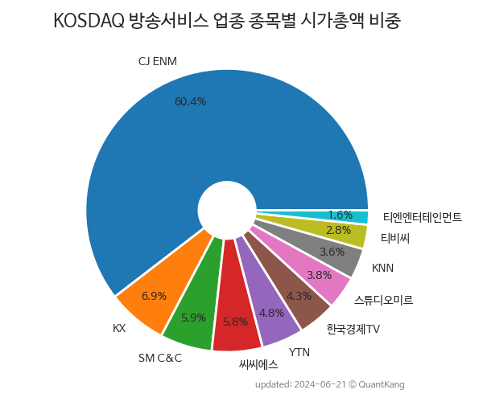](kosdaq_업종_방송서비스_종목/)

[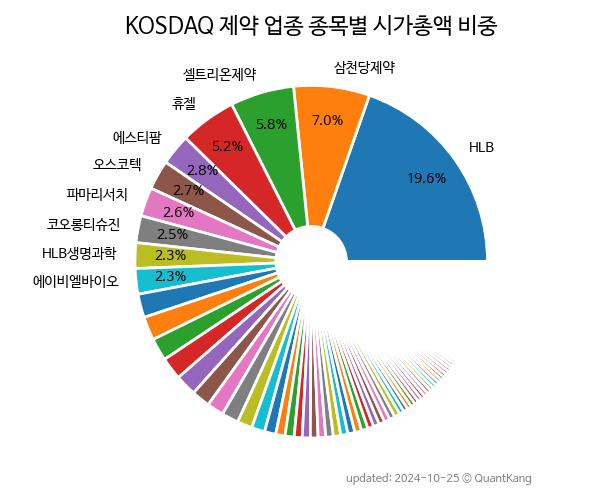](kosdaq_업종_제약_종목/)

[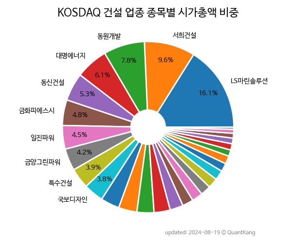](kosdaq_업종_건설_종목/)

[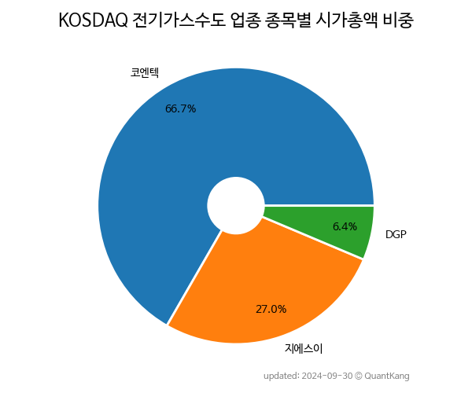](kosdaq_업종_전기가스수도_종목/)

[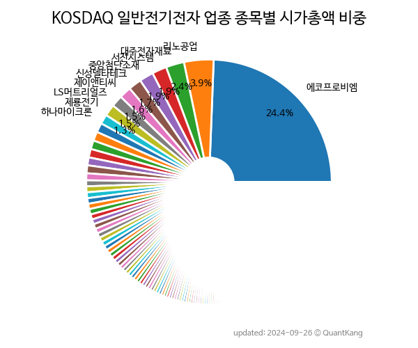](kosdaq_업종_일반전기전자_종목/)

[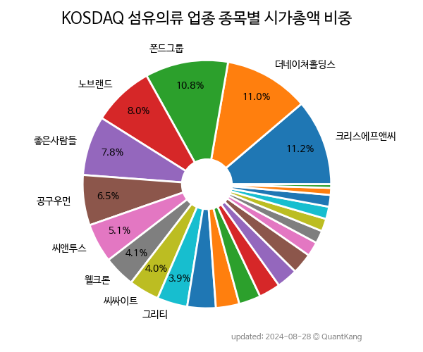](kosdaq_업종_섬유의류_종목/)

[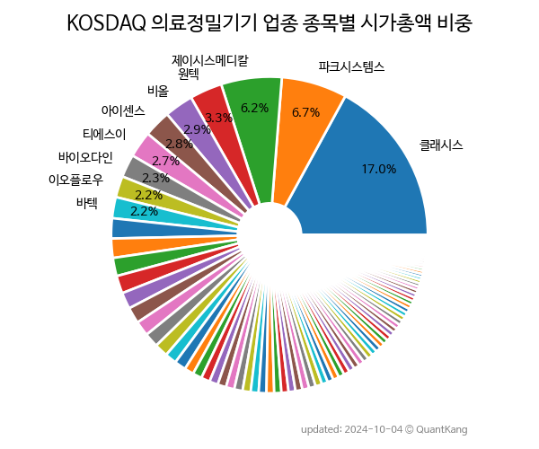](kosdaq_업종_의료정밀기기_종목/)

[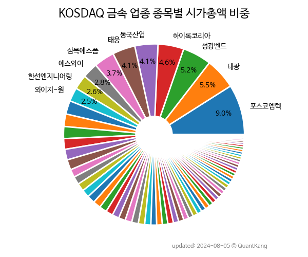](kosdaq_업종_금속_종목/)

[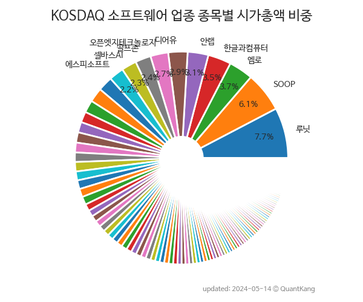](kosdaq_업종_소프트웨어_종목/)

[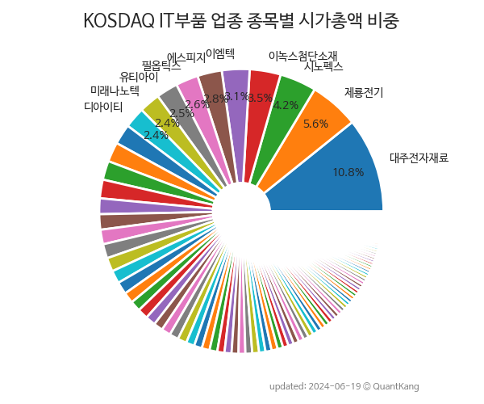](kosdaq_업종_IT부품_종목/)

[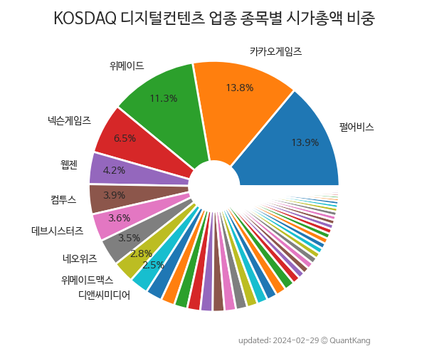](kosdaq_업종_디지털컨텐츠_종목/)

[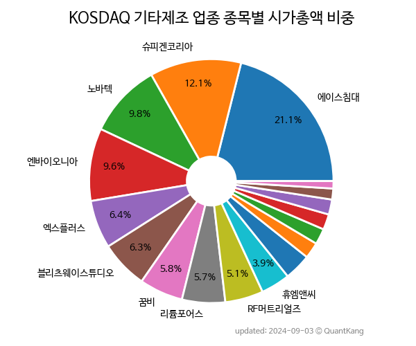](kosdaq_업종_기타제조_종목/)

[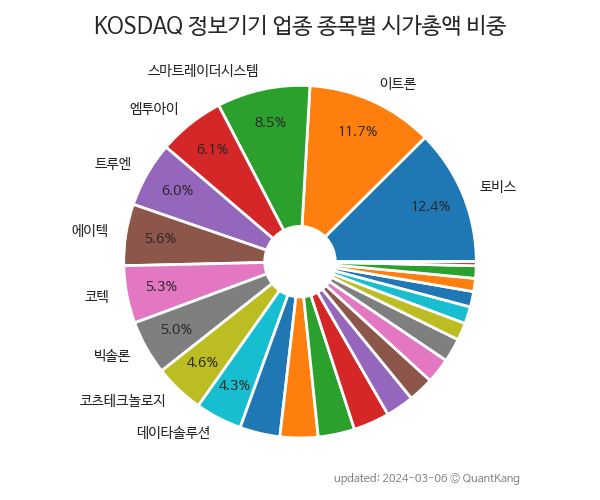](kosdaq_업종_정보기기_종목/)

[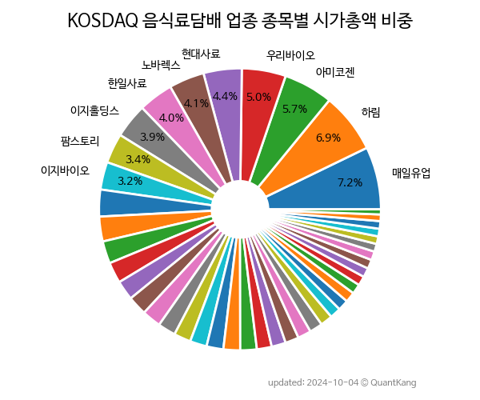](kosdaq_업종_음식료담배_종목/)

[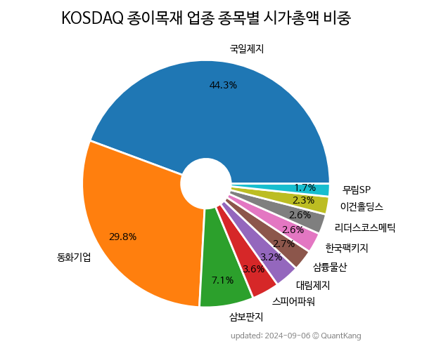](kosdaq_업종_종이목재_종목/)

[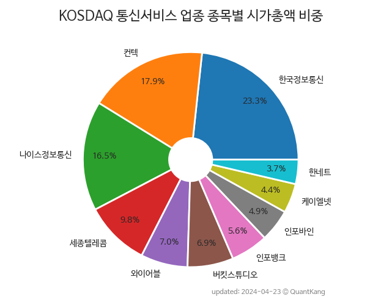](kosdaq_업종_통신서비스_종목/)

